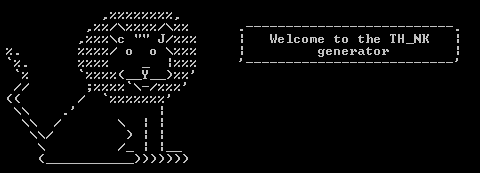

# thinksay

> Tell Yeoman what to say (Shamefully ripped off from yosay ...)

Like yosay but more liony...




## Install

```
$ npm install --save thinksay
```


## Usage

```js
var thinksay = require('thinksay');

console.log(thinksay('Hello, and welcome to my fantastic generator full of whimsy and bubble gum!'));


```

*You can style your text with [chalk](https://github.com/sindresorhus/chalk) before passing it to `thinksay`.*


## CLI

```
$ npm install --global thinksay
```


## License

[BSD license](http://opensource.org/licenses/bsd-license.php)
Copyright (c) Google
